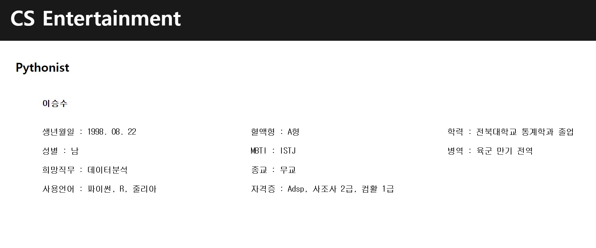

# 🚩 2.HTML 제작
HTML 웹페이지 구성  

----------------------------------------------------------
## 🖥️ 프로젝트 소개
간단한 자기소개 HTML 웹페이지 제작 
 

----------------------------------------------------------
## 🕰️ 프로젝트 기간
* 23.07.23일 - 23.07.27일

----------------------------------------------------------
## ⚙ 개발환경
- <strong>Framework: </strong> html, css
- <strong>IDE: </strong> Visual Studio Code

----------------------------------------------------------
## 📌 프레젠테이션

