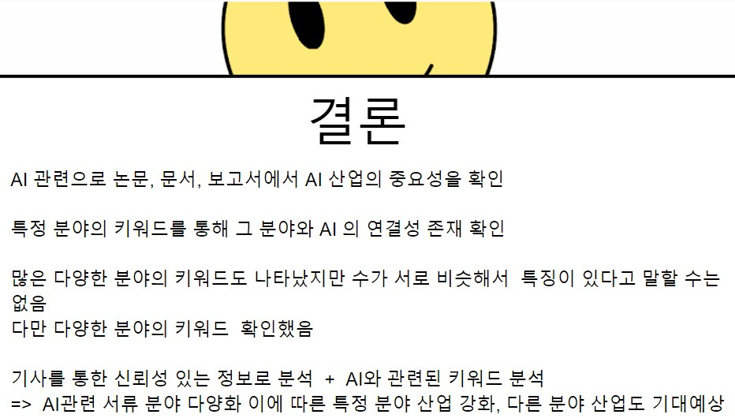

# 🚩 3.뉴스기사 분석
AI관련 기사 조사

----------------------------------------------------------
## 🖥️ 프로젝트 소개
AI와 관련된 다양한 분야의 기사를 분석 
 

----------------------------------------------------------
## 🕰️ 프로젝트 기간
* 2023.07.31 - 2023.08.04

----------------------------------------------------------
## ⚙ 개발환경
- Python (Version 3.8.18 / Window)
- <strong>Framework: </strong> pandas, numpy, matplotlib, wordcloud
- <strong>IDE: </strong> Visual Studio Code, jupyter lab

----------------------------------------------------------
## 📍 프로젝트 구성
뉴스기사 크롤링, 팀 데이터 통합  
워드클라우드, 단어빈도 분석

----------------------------------------------------------
## 📌 프레젠테이션

