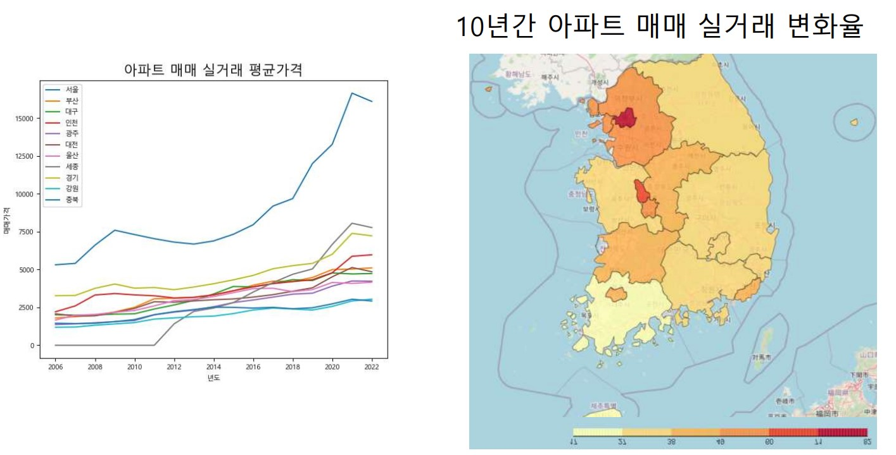

# 🚩 4.재건축 아파트 예측
서울 아파트의 연식, 가격, 위치 분석

----------------------------------------------------------
## 🖥️ 프로젝트 소개
연식, 위치, 교통, 학군 등으로 아파트의 재건축 예측을 시행 
 
매입 시 기대효과 확인 

----------------------------------------------------------
## 🕰️ 프로젝트 기간
* 2023.08.07 - 2023.08.11

----------------------------------------------------------
## ⚙ 개발환경
- Python (Version 3.8.18 / Window)
- <strong>Framework: </strong> pandas, numpy, matplotlib
- <strong>IDE: </strong> Visual Studio Code, jupyter lab

-----------------------------------------------------------
## 📍 프로젝트 구성
서울 아파트 분석 
아파트 주변 거리내 시설 분석 
연식, 주차대수, 교통 등 요인 해석완료 및 예측

----------------------------------------------------------
## 📌 프레젠테이션

