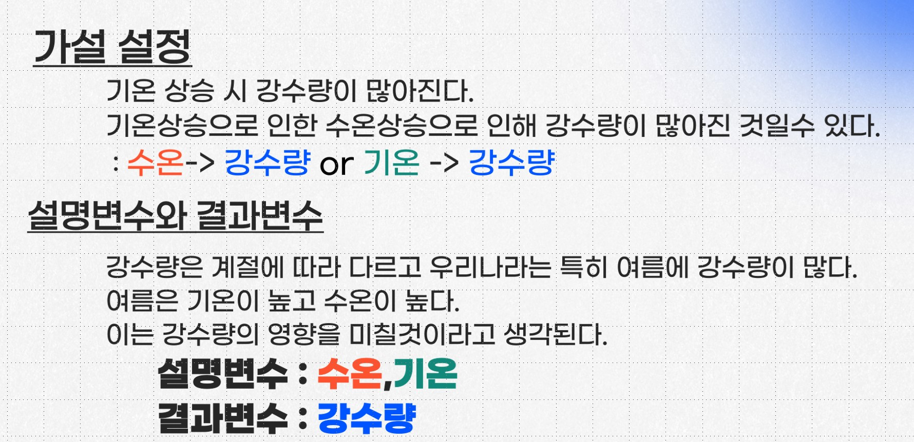

# 🚩 5.수온&기온 분석 및 예측

----------------------------------------------------------
## 🖥️ 프로젝트 소개
수온과 기온의 상관관계 분석 및 예측
 

----------------------------------------------------------
## 🕰️ 프로젝트 기간
* 2023.08.14 - 2023.08.18

----------------------------------------------------------
## ⚙ 개발환경
- Python (Version 3.8.18 / Window)
- <strong>Framework: </strong> pandas, numpy, matplotlib, plotnine
- <strong>IDE: </strong> Visual Studio Code, jupyter lab

-----------------------------------------------------------
## 📍 프로젝트 구성
동해, 남해, 서해 수온과 기온 시각화  
수온과 기온의 관계 통계적 검증 완료

----------------------------------------------------------
## 📌 프레젠테이션

