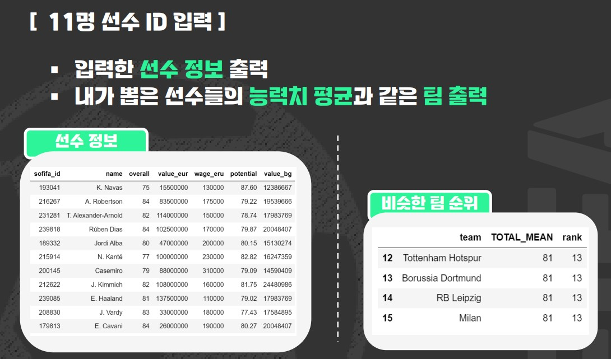

# 🚩 6.피파선수 예측
머신러닝을 활용한 피파선수 검색 서비스

----------------------------------------------------------
## 🖥️ 프로젝트 소개
피파선수의 능력치 분석 및 예측
 
능력치가 좋고 가격이 합리적인 선수 검색

----------------------------------------------------------
## 🕰️ 프로젝트 기간
* 2023.08.21 - 2023.08.25

----------------------------------------------------------
## ⚙ 개발환경
- Python (Version 3.8.18 / Window)
- <strong>Framework: </strong> pandas, numpy, matplotlib, sklearn
- <strong>IDE: </strong> Visual Studio Code, jupyter lab

-----------------------------------------------------------
## 📍 프로젝트 구성
데이터 전처리, 포지션별 분석, 능력치 관계 해석  
모델링, 시연프로그램 구성

----------------------------------------------------------
## 📌 프레젠테이션

