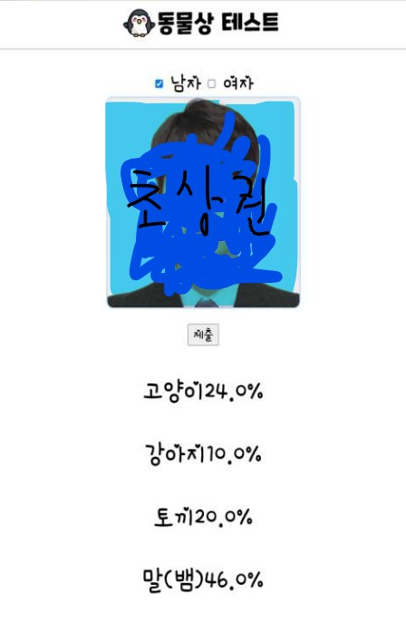

# 🚩 7.동물상 이미지 분류
닮은꼴 동물상 

----------------------------------------------------------
## 🖥️ 프로젝트 소개
남녀별 닮은꼴 동물상 이미지 분류 
 

----------------------------------------------------------
## 🕰️ 프로젝트 기간
* 2023.09.08 - 2023.09.11

----------------------------------------------------------
## ⚙ 개발환경
- Python (Version 3.8.18 / Window)
- <strong>Framework: </strong> pandas, numpy, matplotlib, sklearn, opencv, keras, flask
- <strong>IDE: </strong> Visual Studio Code, jupyter lab

-----------------------------------------------------------
## 📍 프로젝트 구성
강아지, 고양이, 뱀, 토끼 등 대표적인 닮은꼴 연예인으로 모델 학습  
동물상 예측 서비스 구현   

----------------------------------------------------------
## 📌 프레젠테이션

