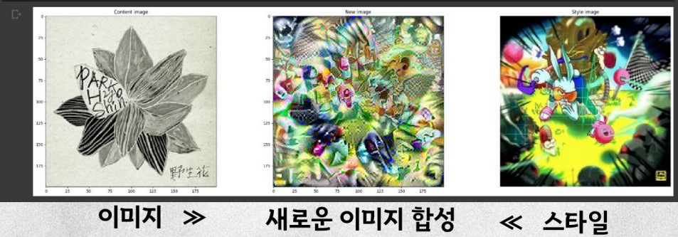

# 🚩 8.멜론앨범표지 분류 및 생성
앨범커버 이미지 학습 후 분류모델 생성 

----------------------------------------------------------
## 🖥️ 프로젝트 소개
멜론에서 앨범커버 이미지 크롤링 
앨범커버 이미지로 시대별 분류 및 새로운 이미지 생성

----------------------------------------------------------
## 🕰️ 프로젝트 기간
* 2023.09.11 - 2023.09.19

----------------------------------------------------------
## ⚙ 개발환경
- Python (Version 3.8.18 / Window)
- <strong>Framework: </strong> pandas, numpy, matplotlib, selenium, requests, sklearn, keras
- <strong>IDE: </strong> Visual Studio Code, jupyter lab

-----------------------------------------------------------
## 📍 프로젝트 구성
멜론 앨범이미지 크롤링, 이미지 데이터 증폭  
keras모델 생성, 스타일전이로 이미지 합성 

----------------------------------------------------------
## 📌 프레젠테이션

