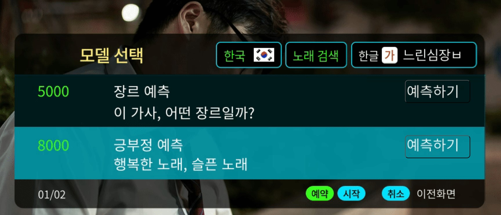

# 🚩 9.노래가사 분석 및 예측
노래 장르 분류, 긍부정 분류 서비스 구현

----------------------------------------------------------
## 🖥️ 프로젝트 소개
멜론에서 노래 가사 크롤링 
노래가사로 장르 분류, 긍부정 분류 모델 생성 및 예측

----------------------------------------------------------
## 🕰️ 프로젝트 기간
* 2023.10.02 - 2023.10.05

----------------------------------------------------------
## ⚙ 개발환경
- Python (Version 3.8.18 / Window)
- <strong>Framework: </strong> pandas, numpy, matplotlib, sklearn, flask, konlpy
- <strong>IDE: </strong> Visual Studio Code, jupyter lab

-----------------------------------------------------------
## 📍 프로젝트 구성
힙합, 발라드, 트로트, 댄스 장르 분류  
장르별 긍부정 분석 및 lda 군집분석  
tfidf 벡터화 후 랜덤포레스트 모델 적합

----------------------------------------------------------
## 📌 프레젠테이션

