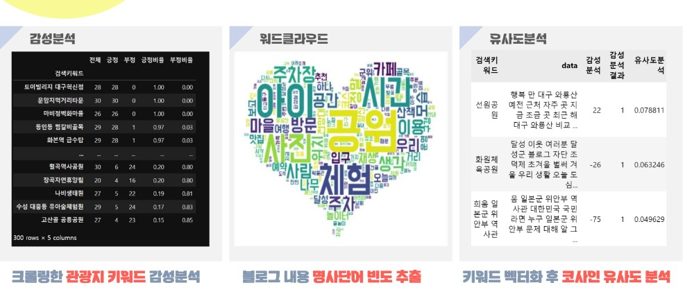

# 🚩 10.대구여행지추천
여행지 리뷰 분석으로 여행지 추천

----------------------------------------------------------
## 🖥️ 프로젝트 소개
여행지(ex : 맛집, 명소, 놀곳) 데이터 크롤링  
여행지 리뷰 텍스트마이닝

----------------------------------------------------------
## 🕰️ 프로젝트 기간
* 2023.10.09 - 2023.10.13

----------------------------------------------------------
## ⚙ 개발환경
- Python (Version 3.8.18 / Window)
- <strong>Framework: </strong> pandas, numpy, matplotlib, sklearn, mariaDB, konlpy
- <strong>IDE: </strong> Visual Studio Code, jupyter lab

-----------------------------------------------------------
## 📍 프로젝트 구성
크롤링 및 DB연결  
키워드 도출 및 여행지 추천 
감성분석, 워드클라우드, 유사도 분석

----------------------------------------------------------
## 📌 프레젠테이션

