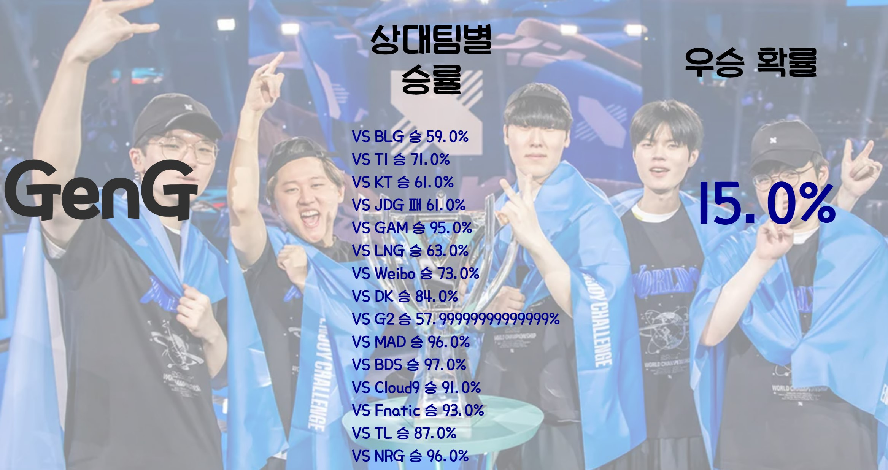

# 🚩 11.롤드컵 승부 예측
2023년 리그오브레전드 월드챔피언십 승부 예측, 우승팀 예측

----------------------------------------------------------
## 🖥️ 프로젝트 소개
리그오브레전드 게임지표 크롤링 
게임결과 부트스트랩 후 승리확률 추출 

----------------------------------------------------------
## 🕰️ 프로젝트 기간
* 2023.10.23 - 2023.10.26

----------------------------------------------------------
## ⚙ 개발환경
- Python (Version 3.8.18 / Window)
- <strong>Framework: </strong> pandas, numpy, selenium, requests, sklearn, flask
- <strong>IDE: </strong> Visual Studio Code, jupyter lab

-----------------------------------------------------------
## 📍 프로젝트 구성
게임지표로 강팀,약팀 분류  
pca 차원축소 예측 및 정규화  
부트스트랩 시행 승리확률 추출

----------------------------------------------------------
## 📌 프레젠테이션

